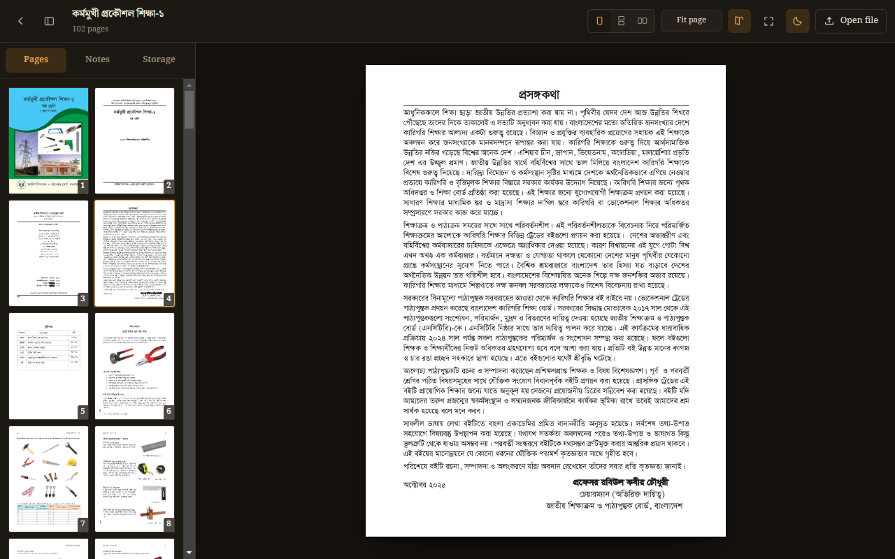
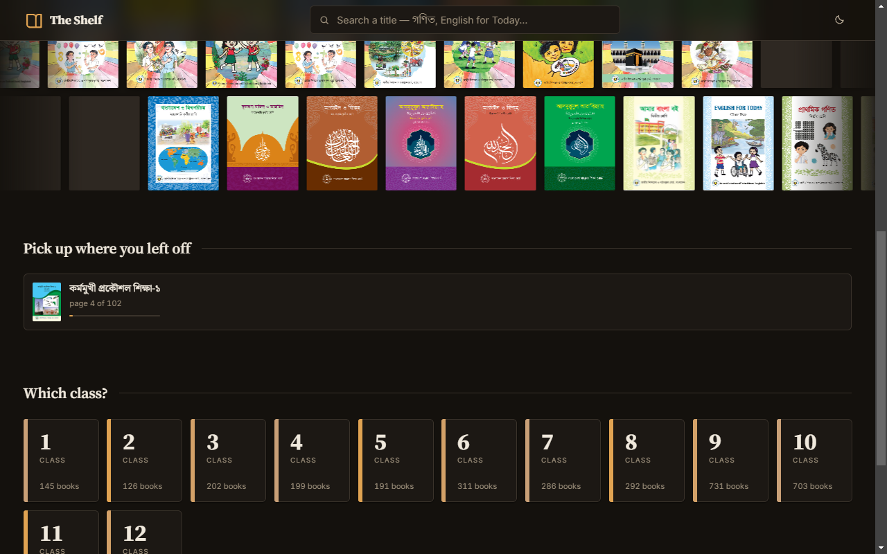
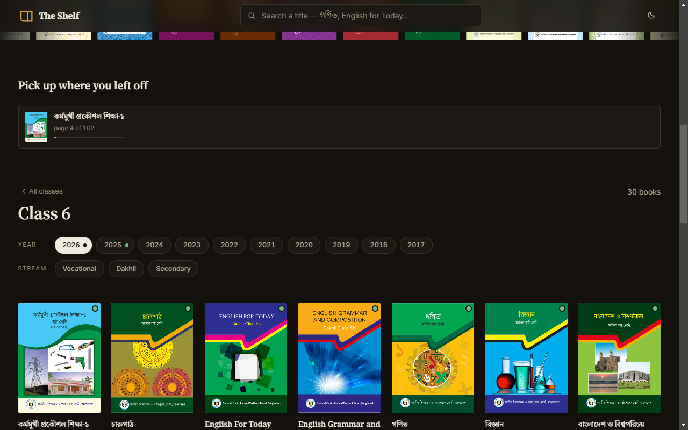
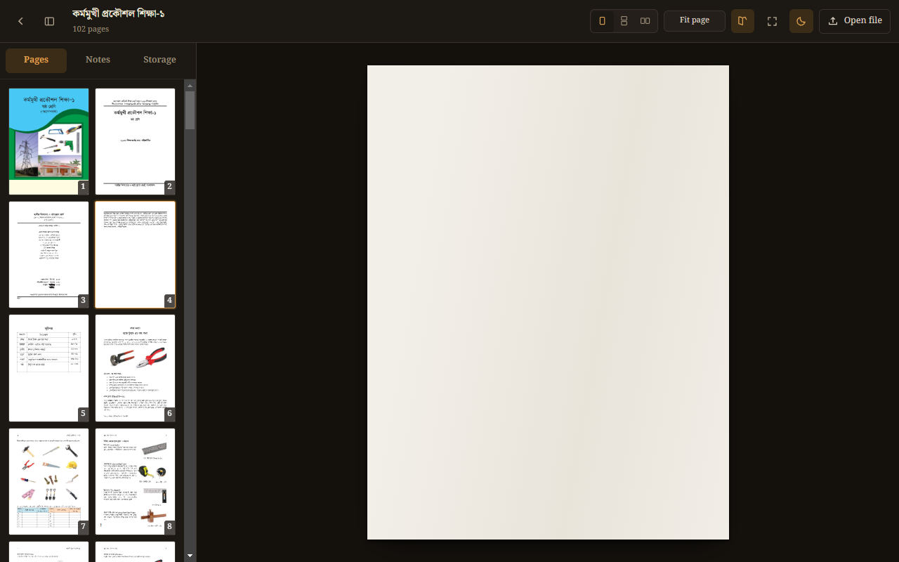
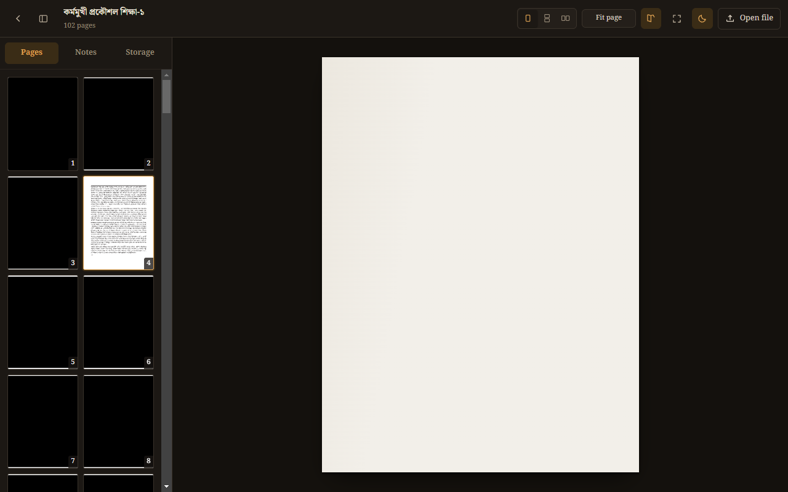

# The Shelf (NCTB Redo) — সব বই, এক জায়গায়

[](https://memio3.github.io/NCTB_Redo/)
[](https://developer.mozilla.org/en-US/docs/Web/JavaScript)
[](https://memio3.github.io/NCTB_Redo/)
[](https://memio3.github.io/NCTB_Redo/)
[-lightgrey.svg)](https://memio3.github.io/NCTB_Redo/)

> **A modern, distraction-free digital textbook shelf and reading workbench for every Bangladesh National Curriculum and Textbook Board (NCTB) book.**

🔗 **Live Web Application:** [https://memio3.github.io/NCTB_Redo/](https://memio3.github.io/NCTB_Redo/)

---

## 🌟 Overview

Finding and reading official NCTB textbooks used to mean navigating dense tables, hunting through fragmented government portals, or struggling with generic PDF viewers. 

**The Shelf (NCTB Redo)** redesigns the entire experience around the student journey:
$$\text{Class} \longrightarrow \text{Year} \longrightarrow \text{Cover} \longrightarrow \text{Read}$$

- **No accounts or signups** — open and read immediately.
- **Zero build steps or heavy frameworks** — pure HTML, CSS, and modern JavaScript modules.
- **Personal annotations** — highlight text, draw in margins, and keep bookmarks that persist on your device across sessions.

---

## 📸 Screenshots & Visual Tour

### 1. The Shelf — Home & Search
*The shelf welcomes you with an ambient design, instant bilingual search, and recent textbook covers.*



---

### 2. Class Selection Grid
*Large, intuitive targets spanning Pre-Primary, Classes 1 through 10, and Classes 11–12 (College/HSC).*



---

### 3. Textbook Covers & Streams
*Visual textbook cards with real covers, academic year selectors (2017–2026), and stream filters (General/Secondary, Dakhil, Vocational).*



---

### 4. In-Browser PDF Reader
*Full-page PDF reader with thumbnail navigation, bookmarks, and multiple reading layouts.*



---

### 5. Immersive Reading & Annotation
*Fit-page typography, distraction-free reading, and local margin notes.*



---

## ✨ Key Features

### 📚 The Shelf (`index.html`)
- **Visual-First Browsing**: Covers are the cards. No abstract file names or dry spreadsheets.
- **Bilingual Search**: Seamless query matching in both Bangla and English (e.g. searching *"Math"* finds *গণিত*, searching *"Bangla"* finds *আমার বাংলা বই*).
- **Multi-Year Archive**: Access 10 academic cycles (2017 to 2026) with automatic fallback to the latest available edition.
- **Multi-Stream Filtering**: Dedicated tabs for Secondary, Dakhil (Madrasah), and Vocational tracks.
- **Deep Linking**: Share exact state with URLs (e.g. `?class=6&year=2026&stream=secondary`).

### 📖 The Reader (`reader.html`)
- **3 Reading Layouts**:
  1. `Single Page`: Scaled to fit your viewport without awkward vertical scrolling.
  2. `Vertical Scroll`: Continuous document flow for skimming.
  3. `Horizontal Strip`: Snaps neatly from page to page.
- **Built-in Annotations**:
  - Highlighting & Freehand Drawing (Pen).
  - Margin sticky notes and page bookmarks.
  - Saved directly to your browser's local storage (`IndexedDB` & `localStorage`).
- **Comfortable Reading Modes**:
  - Dark and Light themes with warm, eye-friendly contrast.
  - Keyboard shortcuts (Arrow keys, Spacebar, Page Up/Down) with built-in auto-repeat rate limiting.
  - Native fullscreen and sidebar toggle.

---

## 🚀 Quick Start (Running Locally)

### On Windows
Simply double-click **`start.bat`** in the repository root.
It will automatically locate your Python installation, launch the local server, and open the site in your default browser.

### Via Command Line
Start the dedicated development server from anywhere in the repository:

```bash
# Using Python 3
python ReDesign/tools/serve.py
```

Then visit:
```
http://localhost:8899/
```

> **Why `serve.py`?**  
> `serve.py` serves the web app and includes the local `/api/drive` streaming handler required to bypass CORS restrictions when fetching books from Google Drive inline.

---

## 📁 Repository Structure

```
NCTB_Redo/
├── .github/
│   └── workflows/
│       └── deploy.yml          # GitHub Actions deployment to GitHub Pages
├── docs/
│   └── screenshots/            # High-resolution screenshots for documentation
│       ├── shelf-overview.png
│       ├── shelf-classes.png
│       ├── shelf-books.png
│       ├── reader-overview.png
│       └── reader-reading.png
├── ReDesign/                   # Core application
│   ├── assets/
│   │   ├── css/                # Tokenized CSS (tokens.css, shelf.css, reader.css)
│   │   ├── js/                 # Modular ESM logic (shelf.js, reader.js, sources.js)
│   │   └── icons/              # SVG UI icons
│   ├── books/                  # Textbook manifests and cover thumbnails
│   │   ├── covers/             # Rendered thumbnail images (~29 MB)
│   │   └── manifest.json       # Catalog indexing & local availability map
│   ├── data/
│   │   └── library.json        # Unified 2,855 textbook metadata database
│   ├── tools/
│   │   ├── serve.py            # Local dev server with drive proxy
│   │   └── fetch_books.py      # Book synchronization & offline caching tool
│   ├── index.html              # The Shelf interface
│   ├── reader.html             # The Reader interface
│   └── start.bat               # Windows launcher
├── endpoints.html              # NCTB raw API reference & route explorer
├── endpoints.json              # Public route catalog & contract specifications
├── index.html                  # Root gateway & redirect to The Shelf
├── start.bat                   # Top-level launcher
└── README.md                   # Project documentation
```

> **Note on Textbooks:** The ~31 GB archive of downloaded PDF textbooks is intentionally excluded from git tracking via `.gitignore` to keep the repository lightweight and within GitHub limits. You can re-sync books on demand using `python ReDesign/tools/fetch_books.py --sync`.

---

## 🌐 Deployment to GitHub Pages

This project is pre-configured for automated continuous deployment via GitHub Actions:
1. Every push to the `master` or `main` branch triggers `.github/workflows/deploy.yml`.
2. The workflow verifies assets and publishes the site directly to GitHub Pages.
3. Access your deployment at: `https://<username>.github.io/<repo-name>/`

---

## 📄 License & Attribution

- **Application Code**: Open-source under MIT License.
- **Textbooks & Content**: Official curriculum materials are property of the National Curriculum and Textbook Board (NCTB), Bangladesh. This project is an independent educational tool designed to improve accessibility for students and educators.
